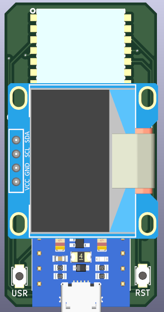
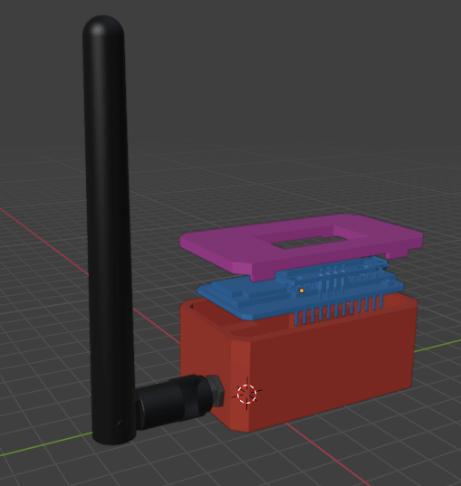

# minimesh
A tiny, low-power Meshtastic compatible device with GPS, enviroment sensor and an OLED display powered by nRF52840

# About

I made this because I found that alot of pre-made Meshtastic nodes are too big and too power hungry, this node uses the nRF52840 chip instead of the ESP32-S3 since it's much more power efficient, while only sacrificing the Wi-Fi feature.

# Images

Schematic (click to expand)

| Schematic |
|-----------|
|  |

| PCB | 3D Preview | Case |
|-----|------------|------|
|  |  |  |
|  |  |  |

# BOM

| Qty | Item                            | Notes                         | Cost (USD) | URL |
|-----|---------------------------------|-------------------------------|------------|-----|
| 2   | nRF52840 ProMicro               | MCU (incl vat+shipping)       | 8.16       | [AliExpress](https://www.aliexpress.com/item/1005006446457448.html)                         |
| 2   | HT-RA62 Transceiver Module      | Can be replaced with RA-01SH  | 15.63      | [AliExpress](https://www.aliexpress.com/item/1005005543917617.html)                         |
| 2   | 0.96" OLED Display              | Pinout needs to be GND,VCC... | 4.36       | [AliExpress](https://www.aliexpress.com/item/1005008738379315.html)                         |
| 4   | Switches                        |                               | 0.99       | [AliExpress](https://www.aliexpress.com/item/4001125532910.html)                            |
| 2   | GP-02-KIT GPS Module            |                               | 11.44      | [AliExpress](https://www.aliexpress.com/item/1005008346885630.html)                         |
| 2   | Slide Switch                    | For GPS module (5mm)          | 1.64       | [AliExpress](https://www.aliexpress.com/item/1005007162182882.html)                         |
| 2   | 868MHz antenna (SMA M)          |                               | 12.60      | [AliExpress](https://www.aliexpress.com/item/1005006712636707.html)                         |
| 2   | BME280 Module                   | Telementary data              | 5.96       | [AliExpress](https://www.aliexpress.com/item/1005008511564094.html)                         |
| 2   | 3.7V BMS Board                  | Prevent overcharging/discharging | 1.32    | [AliExpress](https://www.aliexpress.com/item/1005008760086623.html)                         |
| 2   | Battery Connector               |                               | 0.67       | [AliExpress](https://www.aliexpress.com/item/1005002564191148.html)                         |
|-----|---------------------------------|-------------------------------|------------|-----|
| 5   | PCB                             | Min order qty - 5             | 1.50       | JLCPCB                                                                                      |
|-----|---------------------------------|-------------------------------|------------|-----|
|-----|---------------------------------|-------------------------------| 64.29USD   |-----|

